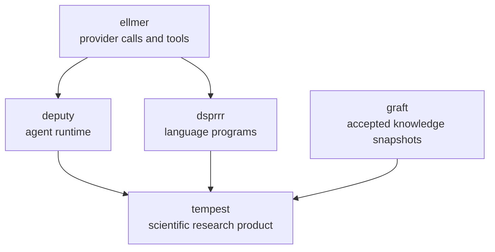

# Package boundaries for Tempest 0.2

Date: 2026-08-15
Status: Accepted
Decision owner: Tempest maintainers

## Decision

Tempest 0.2 will be a scientific-research product, not an
application-neutral framework. It will retain the STORM and Co-STORM product
flows, scientific retrieval, claim-centered evidence, research reports, and
research UI. The experimental generic workflow, runtime, capability,
connection, skill, deliverable, and artifact kernel will be removed in the
0.2.0 release.

The removed kernel will not be extracted into another package. Its useful
responsibilities already have narrower owners in the ecosystem; preserving the
kernel elsewhere would preserve the coordination cost this migration is meant
to eliminate.

This is one deliberate breaking release. The migration sequence is:

1. Add replacement seams.
2. Prove one end-to-end path in shadow mode.
3. Cut the product paths over.
4. Delete the redundant kernel.

## Logical dependency direction

An arrow points from a lower-level owner to a package that consumes its
contract; it does not imply that the lower-level package imports the consumer.
During the transition, graft may be added to Suggests and remain there. Deputy
should move to Imports only after Co-STORM uses it by default. Dsprrr, Deputy,
and graft must not import Tempest to support this migration.

## Package ownership

| Concern | Owner |
|---|---|
| LLM provider calls and tool definitions | ellmer |
| Agent sessions, permissions, budgets, hooks, and delegation | Deputy |
| Typed programs, evaluation, optimization, and compilation | dsprrr |
| Reviewed knowledge, provenance, revisions, and historical snapshots | graft |
| Scientific retrieval, claims, evidence, STORM/Co-STORM, and reports | Tempest |
| Chat rendering | shinychat |
| Evaluation tasks and scorers | vitals |

Tempest composes references from the horizontal packages. It does not duplicate
their state or make them depend on Tempest concepts.

Ellmer owns the generic tool protocol; Tempest still defines scientific tool
behavior and role-specific scientific tool sets. Vitals owns evaluation-task
and scorer machinery; Tempest still defines scientific tasks and evaluation
contracts. Graft owns revisions and snapshots; Tempest still defines the
scientific schema and converts reviewed research proposals into graft plans.

## Tempest product boundary

Tempest owns:

- scientific retrieval and disposable retrieval-index projections;
- run-scoped research workspaces containing sources, evidence spans, proposed
  claims, disputes, and accepted graft references;
- claim extraction, support verification, uncertainty, and contradiction
  handling;
- explicit STORM and Co-STORM product flows;
- product-specific program sets that reference dsprrr artifacts;
- adapters for Deputy execution and immutable graft views;
- path-derived governed, grounded, and exploratory provenance;
- promotion planning without acceptance authority;
- scientific report and promotion bundles;
- STORM and Co-STORM product persistence;
- research UI, evaluation, and trajectory review.

## Explicit non-goals

Tempest is:

- not a generic agent runtime;
- not a general-purpose workflow engine;
- not a universal artifact framework;
- not a capability or connection-management framework;
- not the durable source of accepted organizational knowledge;
- not an optimizer.

## Execution and authority boundaries

| Work | Executor or authority |
|---|---|
| Fixed, typed STORM transformations | Direct dsprrr execution |
| Optimized RLM or Flex programs | Direct dsprrr execution |
| Open-ended expert research | Deputy Agent |
| Moderator tool use and delegation | Deputy-managed agent |
| Side-effecting actions | Deputy permissions and hooks |
| Provisional research evidence | Tempest ResearchWorkspace |
| Accepted knowledge writes | Explicit graft plan, review, and commit |
| Report publication | Tempest or host approval |

The following state boundaries are authoritative:

- A Tempest workspace is mutable, provisional, and scoped to one research run.
- A graft revision is reviewed, accepted knowledge. Tempest never represents
  acceptance with a mutable flag on a provisional claim.
- A dsprrr ProgramArtifact is the executable program identity. Tempest records
  the reference and does not maintain a parallel module artifact format.
- Deputy owns agent sessions and correlated agent/tool events. Tempest records
  opaque run and session references rather than serializing Agent objects.
- Tempest report and promotion bundles are product outputs. They do not become
  a renamed universal artifact catalog.

Product provenance has two independent dimensions:

- `execution_path`: `governed`, `grounded`, or `exploratory`;
- `support_status`: `verified`, `partially_supported`, `unsupported`,
  `conflicted`, or `unknown`.

A dsprrr execution is governed only when an accepted governed-procedure
revision references the exact program artifact, that exact artifact executed,
and no lower-trust fallback occurred. Using dsprrr alone is not sufficient.

## Generic-kernel retirement

Development of the following application-neutral subsystems is frozen. Only
changes needed to preserve the product baseline or complete their replacement
are in scope before removal in 0.2.0.

| Current subsystem | Primary files | Destination |
|---|---|---|
| Operation registry | `R/operation-registry.R`, generic portions of `R/deliverables.R` | Direct product flow, dsprrr programs, or Deputy tools |
| Workflow specifications and generic runs | `R/workflow-types.R`, `R/workflow-spec.R`, `R/tempest-run.R`, `R/run-accessors.R`, `R/builtin-workflows.R` | Explicit STORM/Co-STORM flow plus dsprrr and Deputy execution |
| Capability, connection, and runtime resolution | `R/capabilities.R`, `R/runtime.R`, generic portions of `R/expert-types.R` | Deputy permissions and explicit tool sets; host injection for connections |
| Generic deliverables and artifacts | `R/artifact-catalog.R`, `R/artifact-codecs.R`, `R/artifact-bundle.R`, artifact-store portions of `R/config.R`, and generic portions of `R/deliverables.R` | TempestReportBundle, TempestPromotionBundle, and dsprrr artifacts |
| Generic persistence and host UI | Generic portions of `R/run-persistence.R` and `R/shiny-adapter.R`; `inst/examples/shiny-host/` | Product-specific STORM/Co-STORM bundles and research UI |
| Runtime skills | Generic portions of `R/expert-types.R` and `R/capabilities.R` | Deputy skills and tools; slim Tempest scientific expert profiles |

The public export families scheduled for removal are documented in
`tempest-generic-kernel-retirement`. No new feature may depend on them. The
`SourceStore` rename, transition from Tempest's checksummed dsprrr
ProgramArtifact bundle to `TempestProgramSet`, and expert-runtime cutover happen
through additive product seams before deletion.

Several retirement files contain product code and must be split before they are
deleted:

- `R/runtime.R` also constructs scientific retrieval, evidence, web, and
  delegation tools;
- `R/expert-types.R` also defines the slim scientific expert profile;
- `R/deliverables.R` also implements STORM and Co-STORM report generation;
- `R/shiny-adapter.R` also implements product research panels;
- `R/config.R` also defines the product configuration while carrying the
  generic artifact-store adapter;
- `R/models.R` contains ResearchWorkspace plus the deprecated SourceStore
  compatibility subclass whose arbitrary artifact environment must be removed.
- `R/resources.R` exposes application-neutral resource kinds today. Its public
  seam must narrow to scientific sources and context evidence; host connection
  identifiers remain opaque injected references rather than a general
  connection-management framework.

Deleting a filename is never the goal by itself. Product behavior moves to a
narrower product file first; only the application-neutral portion is removed.
Generic validation helpers currently used by product code must likewise be
extracted before `R/workflow-types.R` is deleted.

The T0 retirement manifest contains 43 generic-kernel exports. The three
Tempest-specific dsprrr program-bundle and optimization exports are tracked
separately for narrowing into `TempestProgramSet` and exact program identities
in T2. Shared product seams such as `tempest_execution_events()`,
`tempest_validation_result()`, and `tempest_shiny_store()` are narrowed during
the cutover rather than preemptively classified as deleted.

Old generic workflow and artifact bundles will not receive migration
machinery. After the cutover they must fail with a direct explanation that
Tempest 0.2 supports only STORM and Co-STORM product bundles.

## Tempest migration train

| Work item | Result |
|---|---|
| T0 | Freeze these boundaries and capture deterministic product behavior. |
| T1 | Add TempestResearchManifest and ResearchWorkspace without changing behavior. |
| T2 | Add TempestProgramSet and explicit per-stage fallback policies. |
| T3 | Add the scientific graft schema and promotion bundles. |
| T4 | Bind accepted context to immutable graft snapshots. |
| T5 | Move Co-STORM expert execution beneath a Deputy adapter. |
| T6 | Prove claim extraction and verification across all four packages in shadow mode. |
| T7 | Make the new STORM and Co-STORM paths authoritative. |
| T8 | Delete the experimental generic kernel and its exports. |
| T9 | Retain only product-specific persistence, reports, and UI. |
| T10 | Add joined trajectory review, improvement loops, and release 0.2.0. |

Dsprrr program identity and trace context, graft snapshot views, and Deputy run
context and correlated events must merge before T2 through T5 are considered
stable. They may be developed in parallel outside this repository.

## Deterministic product baseline

The baseline records semantic outcomes, never exact provider prose. Tests use
fake chats, local stores, package fixtures, and bounded asynchronous helpers;
they require no API keys, network access, or live provider responses.

| Product behavior | Deterministic evidence |
|---|---|
| Scripted STORM stage sequence and terminal status | `tests/testthat/test-product-baseline.R`, `tests/testthat/test-storm.R` |
| Co-STORM warmup and one moderator turn | `tests/testthat/test-product-baseline.R`, `tests/testthat/test-costorm-progress.R`, `tests/testthat/test-costorm-warmup.R` |
| Custom expert roster construction and session controls | `tests/testthat/test-shiny-app.R` |
| Claim extraction | `tests/testthat/test-product-baseline.R`, `tests/testthat/test-claim-extraction.R` |
| Claim support verification | `tests/testthat/test-product-baseline.R`, `tests/testthat/test-verify.R` |
| Source and citation rendering | `tests/testthat/test-product-baseline.R`, `tests/testthat/test-citations-policy.R` |
| Report generation and section identity | `tests/testthat/test-product-baseline.R`, `tests/testthat/test-writing.R`, `tests/testthat/test-costorm-async.R` |
| Cancellation | `tests/testthat/test-product-baseline.R`, `tests/testthat/test-async.R`, `tests/testthat/test-run-accessors.R` |
| STORM and Co-STORM save/resume | `tests/testthat/test-product-baseline.R`, `tests/testthat/test-run-persistence.R`, `tests/testthat/test-tempest-run-bundle.R` |
| Research manifest, state, and workspace correlation | `tests/testthat/test-research-manifest.R`, `tests/testthat/test-research-session.R`, `tests/testthat/test-research-workspace.R`, `tests/testthat/test-storm-state.R` |
| Current public exports and retirement set | `tests/testthat/test-public-api.R` |

The semantic projections assert:

- completed stages and their order;
- source and claim IDs;
- claim verification states;
- citation references;
- report section names;
- terminal status;
- normalized event sequence;
- durable state after save and resume;
- cancellation state transitions;
- custom expert roster selection and session controls;
- the exact pre-0.2 public export surface.

On 2026-08-15, after integrating the custom-expert and dsprrr ProgramArtifact
work from PR #28, the full package suite completed with 2,535 passing
expectations and no failures, warnings, or skips.

The T0 pre-0.2 namespace baseline contains 96 explicit exports and two
registered S3 print methods. T1 adds exactly three product exports:
`ResearchWorkspace`, `tempest_research_manifest()`, and
`tempest_research_workspace()`, bringing the current additive surface to 99
exports. The versioned T0 fixture remains unchanged through the additive train;
T8 must make the removal diff explicit rather than silently rewriting history.

## Superseded decisions

This decision supersedes earlier application-neutral ownership claims in:

- `dev/specs/2026-07-18-reusable-tempest-workflows.md`;
- the generic artifact portions of
  `dev/specs/2026-06-28-host-app-modularity.md`;
- the compatibility policy in
  `dev/specs/2026-06-28-session-persistence.md`;
- the general-purpose ledger and warning-only fallback direction in
  `dev/specs/2026-06-27-evidence-ledger-s7-design.md`;
- abrupt-removal guidance in
  `dev/specs/2026-06-29-api-lifecycle-style.md`;
- the prior decision to defer an external scientific schema in
  `dev/specs/2026-06-29-data-dict-evaluation.md`.

Those documents remain historical implementation records. Where they conflict
with this accepted boundary, this decision governs Tempest 0.2 work.

## Cutover invariants

Every later Tempest migration PR must preserve or intentionally revise the
semantic baseline and must maintain these invariants:

- no silent fallback;
- every governed result identifies an accepted governed-procedure revision and
  the exact dsprrr program artifact;
- every agent-derived result identifies Deputy run and session references;
- every accepted-context read identifies an immutable graft snapshot;
- uncommitted workspace knowledge cannot enter governed context;
- manifests and bundles contain no chats, functions, tools, credentials,
  clients, connections, store handles, Agent objects, or code-runner objects;
- no forbidden reverse dependency is introduced.

Deletion begins only after the claim extraction and support-verification shadow
slice meets these invariants and is no worse than the current correctness and
citation-support baseline.
