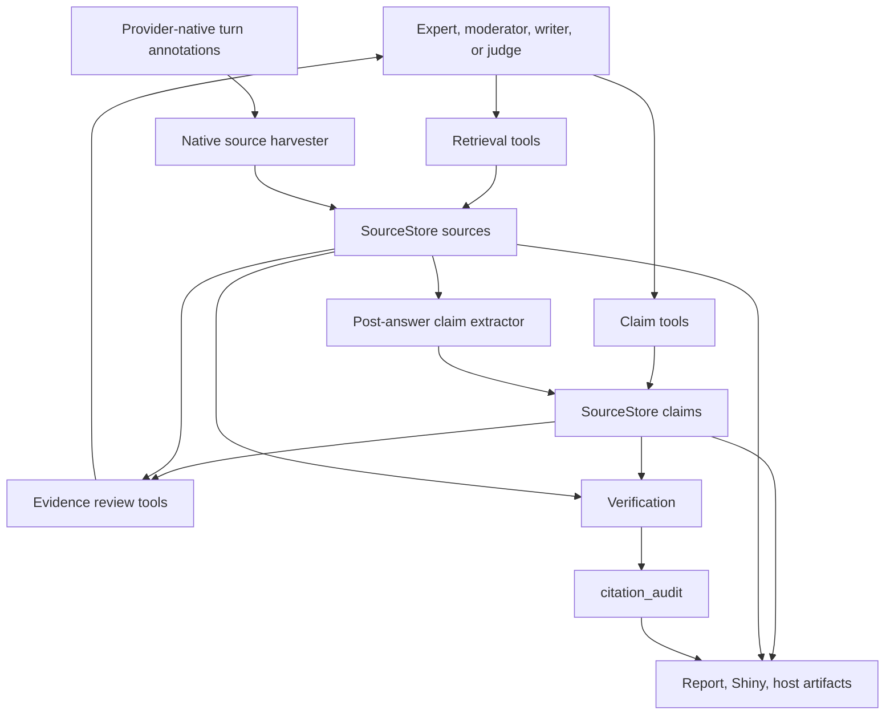

# Evidence-oriented tool calls for STORM and Co-STORM

Date: 2026-06-28
Status: Proposed design
Scope: Agent-facing and internal evidence tools for STORM and Co-STORM.

## Goal

Tempest already has a claim-centered evidence ledger: sources live in
`SourceStore`, factual statements are `tempest_claim` S7 records, and
verification writes a `citation_audit`. The remaining gap is the tool contract
that agents use while researching. Today the package still exposes a mixed
surface of web tools, source management tools, `add_fact()` / `list_facts()`,
provider-native web tools, expert-delegation tools, and post-hoc extraction.

The target model is one evidence contract shared by STORM, Co-STORM, and host
apps. Retrieval tools discover and read sources. Claim tools record atomic
claims linked to those sources. Review tools let agents inspect the ledger
before answering or writing. Verification tools judge support. Internal
adapters normalize provider-native citations and custom retriever output into
the same source and claim records.

## Current surface

| Area | Current symbols | Notes |
|---|---|---|
| Custom retrieval | `web_search`, `fetch_url`, `get_source`, `list_sources` from `tempest_tools_retrieval()` | Uses `TempestRetriever` and writes fetched sources into `SourceStore`. |
| Native retrieval | `tempest_get_native_web_tools()` plus `tempest_tools_source_management()` | Provider search/fetch happens inside ellmer, then Tempest harvests sources from turns. |
| Claim writes | `add_fact`, `list_facts` | Writes `tempest_claim` records, but the tool names still say fact. |
| Claim extraction | `tempest_extract_facts_from_answer()` | Extracts claims after an answer and rejects unknown source ids. |
| dsprrr extraction | `extract_claims` from `tempest_make_dsprrr_modules()` | Currently accepts only `answer_text`, so native source context cannot reach the module. |
| Expert delegation | `ask_*` tools from `tempest_create_expert_tool()` | Returns `response` and `session_id`; extracts claims as a side effect. |
| Verification | `tempest_verify_claims()` and `verify_claim_support` | Internal report-stage support judgment, not an agent-facing review tool yet. |
| UI/report consumers | `tempest_sources()`, `tempest_claims()`, report helpers, Shiny modules | Read from `SourceStore` artifacts and claim/source tibbles. |

The current native-citation path is intentionally conservative: when a turn has
harvested provider-native source ids, `tempest_extract_facts_from_answer()`
bypasses dsprrr and uses a direct `chat_structured()` prompt that includes a
`<known_sources>` block. This keeps sources and claims populated, but it prevents
dsprrr optimization and evaluation from applying to one of the most important
evidence paths.

## Target evidence objects

Use the existing ledger records as the canonical data model.

| Concept | Canonical record | Agent-visible shape |
|---|---|---|
| Source | source list in `SourceStore` | `source_id`, `url`, `title`, `snippet`, short `excerpt`, `kind`, `fetched_at`, optional quality metadata. |
| Citation | reference from answer text to source | Inline `[S...]` marker, provider-native annotation, URL, or source id normalized to `source_id`. |
| Claim | `tempest_claim` | `claim_id`, `claim_text`, `source_ids`, `confidence`, `verification_status`, `support_score`, provenance. |
| Evidence span | `tempest_evidence_span` | `evidence_span_id`, `source_id`, `quote`, offset/page metadata when known, relevance score. |
| Dispute | `tempest_dispute` | `dispute_id`, `claim_ids`, disagreement axis, evidence balance, unresolved questions. |
| Citation audit | tibble artifact | One row per verified claim with status, score, and rationale. |

"Fact" should remain only as UI copy where it helps users. Agent tools and
package contracts should say "claim" because claims are typed, cite sources,
and can be verified.

## Data flow

The key boundary is normalization. Whether a source comes from Tempest's
custom `fetch_url`, provider-native search, a ragnar retrieve tool, or a host
retriever, it must enter `SourceStore` with a stable `source_id` before any
claim can cite it.

## Role matrix

| Role | Allowed tools | Expected inputs | Expected outputs |
|---|---|---|---|
| Expert | Search/fetch, `get_source`, `list_sources`, `add_claim`, optional `list_claims` for continuity | Topic, expert perspective, question, optional expert `session_id` | Cited answer, new sources, atomic claims, returned `session_id`. |
| Moderator | `ask_*`, `list_sources`, `list_claims`, `get_claim`, `get_source`, read-only evidence review | User turn, mind map, transcript, expert tool result, correlation id | Synthesized answer with citations, expert call events, no direct source invention. |
| Mind-map updater | Read-only `list_claims`, `list_sources`, optionally `get_claim` | Latest exchange and current map | Nodes linked to known `source_ids`; no claim writes. |
| Writer | Read-only `list_claims`, `get_claim`, `get_source`, `get_evidence_for_claim`, citation audit | Outline section, verified or source-attributed claims | Report text preserving `[S...]` citations and omitting unsupported claims under strict policy. |
| Judge/verifier | `get_source`, `get_evidence_for_claim`, internal `verify_claim_support` | Claim text, cited source excerpts or spans | Verification status, support score, rationale, audit row. |
| Extractor | Internal `extract_claims` module or direct fallback | Answer text, source context, citation mode, provenance | Normalized claim candidates that become `tempest_claim` records. |
| Host app | Public accessors and event/artifact APIs, not live chat internals | `session_id`, run id, artifact store, event sink | Reusable sources, claims, mind map, report Markdown, citation audit, progress events. |

Experts can write claims because they read sources directly. Moderators and
writers should primarily review and synthesize. Judges should only verify
support. The extractor remains internal because it converts generated text into
ledger records and must enforce validation before mutation.

## Proposed tools and adapters

### Retrieval tools

Keep the current `web_search`, `fetch_url`, `get_source`, and `list_sources`
contracts for custom retrievers. For provider-native retrieval, continue
registering native ellmer tools and the source-management tools, then harvest
sources from the resulting turn.

All retrieval paths should emit or return enough metadata for later
normalization:

- `source_id`
- `url`
- `title`
- `snippet`
- short `excerpt`
- `kind`, such as `native_search`, `native_fetch`, `web_search`, or `ragnar`
- retrieval provenance, including query, role, persona id, session id, and
  correlation id when available

### Claim tools

Rename the agent-facing write/read tools from fact language to claim language:

- `add_claim(claim_text, source_ids, confidence = "medium", quote = NULL)`
- `list_claims(status = NULL, source_id = NULL, limit = 20)`
- `get_claim(claim_id)`

`add_claim()` should construct a `tempest_claim` and fail when all cited
sources are unknown. It should not silently create placeholder sources. It may
accept optional quotes and create best-effort evidence spans later, but source
ids remain the required support link.

`add_fact()` / `list_facts()` can stay as short transitional aliases if the
current prompt/tests need them, but new prompts and docs should use claim names.

### Evidence review tools

Add a read-only review set for moderators, writers, judges, and host adapters:

- `get_source(source_id, excerpt_chars = 1200)`
- `list_sources(kind = NULL, limit = 20)`
- `get_evidence_for_claim(claim_id)`
- `list_unsupported_claims(limit = 20)`
- `list_citation_audit(limit = 20)`

These tools should return compact payloads. Long source bodies belong in the
store, not in tool results.

### Internal extraction adapters

Keep post-answer extraction as an internal adapter, not as a general tool the
moderator calls directly. It should:

1. Harvest provider-native sources from the last turn.
2. Build a source context from attached `source_ids`, inline `[S...]` markers,
   and URLs present in the answer.
3. Run `extract_claims` through dsprrr with that context when available.
4. Fall back to direct `chat_structured()` only when the module is absent or
   fails.
5. Normalize source references, reject unknown sources, and add validated
   `tempest_claim` records to `SourceStore`.

This design avoids brittle prompt-only behavior while preserving the reliable
fallback that fixed the recent facts/sources regression.

## dsprrr and native sources

The way around the current bypass is to change the module signature. The
`extract_claims` dsprrr module should accept:

- `answer_text`: the answer to extract from.
- `source_context`: a compact Markdown or JSON block of known sources.
- `source_ids`: attached source ids from provider-native annotations.
- `citation_mode`: one of `tempest_inline`, `provider_native`, `url`, or
  `mixed`.
- Optional provenance fields: `workflow`, `stage`, `role`, `persona_id`,
  `session_id`, and `correlation_id`.

For no-source-context runs, `source_context` is an empty string and `source_ids`
is empty. The module instructions can still require `[S...]` citations. For
native-provider runs, the module must return only source ids present in
`source_context`. This lets dsprrr handle both ordinary and native-citation
paths while the direct ellmer prompt remains a fallback.

This is preferable to bypassing dsprrr because it keeps extraction measurable,
optimizable, and shared across STORM and Co-STORM. It is also preferable to
making native provider annotations first-class claim records on their own
because provider annotations are evidence for a turn, not normalized package
state until Tempest maps them to source ids.

## Session and correlation requirements

`session_id` should be used for continuity and attribution, but not as the
primary source or claim id.

- A Co-STORM session id is the run id for session-level events.
- Each expert tool result returns an expert `session_id`; later `ask_*` calls
  may pass it back to resume that expert conversation.
- Every tool call and extraction pass should carry a `correlation_id` linking
  progress events, harvested sources, extracted claims, and expert responses.
- Claim provenance should record available `session_id`, `persona_id`, stage,
  and correlation id once the S7 record supports those fields.
- Host apps should receive these ids in progress events and artifact metadata
  so a UI can replay or debug why a claim appeared.

The existing `vtz9` kata issue should audit the expert-tool session propagation
details. This design adds the evidence requirement: source and claim writes
need enough provenance to connect them back to a session and turn.

## Failure policy

Evidence failures should be explicit and localized.

| Failure | Behavior |
|---|---|
| Unknown source id | Reject the claim candidate or mark it malformed before ledger insertion. Do not create placeholder sources. |
| Provider-native source cannot be mapped | Keep the answer text, emit a progress/debug event, and do not add a supported claim for that citation. |
| Claim has no sources | Skip it for the evidence ledger unless the role is explicitly recording an open question or limitation. |
| Malformed structured output | Normalize safe fields, emit a warning/debug event, and continue with other candidates. |
| dsprrr module failure | Warn and fall back to direct `chat_structured()` extraction with the same source context. |
| Unsupported verified claim | Keep the claim with `verification_status`, then flag/drop/revise at report assembly according to `citation_policy`. |
| Tool result too large | Return compact excerpts and make full content available only through store accessors. |

## Migration plan

1. `c8jk`: Make `extract_claims` source-context aware so dsprrr can handle
   provider-native and custom citation paths before falling back to direct
   ellmer extraction.
2. `msg3`: Rename agent-facing fact tools to claim tools and update prompts to
   use claim language while deciding whether fact aliases remain temporarily.
3. `my3y`: Add role-appropriate evidence review tools for sources, claims,
   support spans, and verification status.
4. `vtz9`: Audit expert `session_id` propagation and extend the audit to source
   and claim provenance where the ledger schema supports it.
5. `wedz`: Consume the same source/claim/provenance events from the
   host-agnostic progress layer so Shiny and host apps can render evidence
   updates without scraping chat text.

This order fixes the highest-value correctness gap first, then clarifies the
tool contract, then improves review and observability.

## Deterministic tests

The implementation issues should use fake chats, fake retrievers, fake turns,
and in-memory stores. No test should require API keys, network, or live provider
responses.

- `extract_claims` with ordinary `[S...]` citations uses dsprrr and rejects
  unknown ids.
- `extract_claims` with provider-native harvested source ids uses dsprrr with
  `source_context`.
- dsprrr failure falls back to direct `chat_structured()` and still uses the
  same known source context.
- URL citations normalize to existing source ids.
- Claim tools reject writes with no known sources.
- Review tools return compact, stable payloads for empty and populated ledgers.
- Role-based tool registration gives experts write access, moderators and
  writers review access, and judges verification access.
- Expert `session_id` and turn `correlation_id` appear in progress events and,
  when supported, claim provenance.
- Shiny module tests prove facts/sources UI updates from claims and sources
  created during warmup and chat extraction.
- STORM and Co-STORM fake runs produce non-empty `sources`, `claims`, and
  optional `citation_audit` artifacts.

## Success criteria

1. STORM and Co-STORM use one source/claim ledger regardless of whether
   retrieval is custom, native-provider, or host supplied.
2. dsprrr remains the primary structured extraction path, including native
   source contexts.
3. Agents see claim-oriented tools, not a mix of fact and claim vocabulary.
4. Moderators, writers, and judges can inspect evidence without unrestricted
   write tools.
5. Unknown or unsupported evidence is flagged instead of silently converted to
   placeholders.
6. Session and correlation ids can explain which expert, turn, and tool call
   produced a source or claim.
