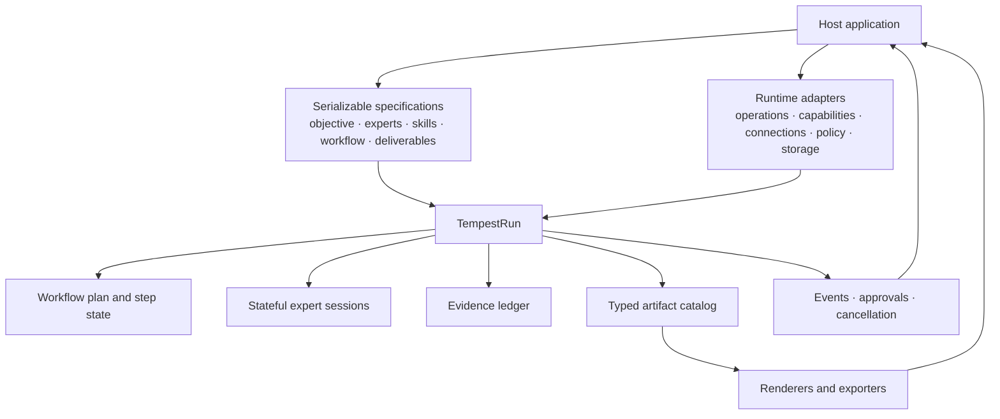
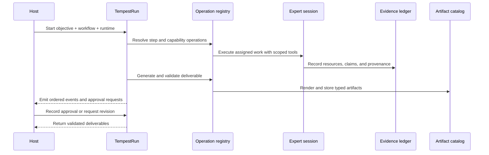

# Reusable Tempest workflow architecture

Date: 2026-07-18
Status: Approved; implementation in progress
Audience: Tempest maintainers, host-application developers, and coding agents

## Overview

Tempest should support applications that turn an objective into one or more
evidence-backed deliverables using a selected team of experts and scoped
capabilities. Opportunity exploration is one possible host application, but no
Opportunity Explorer, customer, CRM, or sales concept belongs in the package.

The package currently exposes useful host seams for expert personas, retrieval,
evidence, artifacts, progress, persistence, and embedded Shiny panels. Those
seams are still organized around two fixed workflows:

- STORM accepts a topic and executes perspectives, research, outline, write,
  and polish stages to produce one Markdown report.
- Co-STORM accepts a topic, generates or accepts personas, maintains a
  conversation and mind map, and produces one technical or executive Markdown
  report.

The new architecture adds a small application-neutral orchestration kernel
beneath STORM and Co-STORM. Hosts provide serializable specifications and
runtime adapters. Tempest owns execution state, expert delegation, evidence,
artifact lineage, events, validation, persistence, and cancellation.

Backward compatibility is not a design constraint. Existing public functions
may remain as convenient built-in workflows when doing so keeps the package
clear, but new contracts should not be weakened to preserve old argument or
artifact shapes.

## Goals

1. Let a host express an objective with context, constraints, acceptance
   criteria, and requested deliverables.
2. Let a host supply stable expert and skill definitions without exposing live
   chat internals.
3. Resolve per-run, per-expert capabilities and connections with least
   privilege.
4. Generate structured deliverable content, validate it, render it into one or
   more artifacts, and retain evidence lineage.
5. Execute built-in or host-defined workflows through one observable,
   cancellable, and resumable run model.
6. Let host applications own identity, credentials, storage policy, UI, and
   business-specific data.
7. Keep tests deterministic and free of API keys, network access, and live
   provider responses.

## Non-goals

- A customer, opportunity, CRM, or sales domain model in Tempest.
- A credential vault or connector marketplace.
- A general-purpose distributed workflow engine.
- Serialization of functions, credentials, provider clients, chat objects, or
  tool closures.
- A requirement that every workflow use web research, a mind map, or Markdown.
- A requirement that every host use the bundled Shiny interface.

## Architecture

### Ownership boundary

The host application owns:

- users, tenants, customers, projects, and other business entities;
- the expert catalog and its presentation;
- authenticated connections and secret storage;
- the decision to grant a capability for a particular run;
- approval UI and final publishing;
- durable infrastructure behind adapter contracts; and
- application-specific rendering and navigation.

Tempest owns:

- validated value contracts;
- workflow and assignment execution;
- live expert-session lifecycle;
- evidence, claims, spans, disputes, and provenance;
- artifact metadata and lineage;
- validation and approval state;
- events, cancellation, snapshots, and resume behavior; and
- built-in STORM and Co-STORM workflow definitions.

## Value contracts

New serializable boundaries use S7. Mutable runtime components remain R6. This
continues the package decision used by `TempestConfig`, evidence records,
`SourceStore`, and `TempestSession`.

### Objective

`tempest_objective()` creates a `tempest_objective` value with:

- `objective_id`: stable string identity;
- `title`: short display title;
- `description`: the requested outcome;
- `context`: serializable host-provided context;
- `constraints`: requirements and exclusions;
- `acceptance_criteria`: observable conditions for completion;
- `input_resource_ids`: approved resource references;
- `deliverable_ids`: requested deliverable specification ids;
- `metadata`: namespaced host metadata;
- `created_at`; and
- `schema_version`.

A single non-empty string may be accepted as shorthand for a minimal objective,
but runtime code should normalize it immediately.

### Deliverable specification

An output template is a contract, not only a prompt or Markdown skeleton.
`tempest_deliverable_spec()` creates a versioned
`tempest_deliverable_spec` containing:

- stable `deliverable_id` and `version`;
- title, purpose, and generation instructions;
- a serializable content schema;
- required fields or sections;
- evidence requirements;
- generator, validator, renderer, and exporter operation ids;
- content and media types;
- filename policy;
- approval requirements; and
- metadata.

Executable generator, validator, renderer, and exporter functions live in a
runtime operation registry. Specifications persist operation ids and versions,
never closures.

One deliverable may produce several artifacts. For example, one response
package can produce a Markdown response, a JSON evidence appendix, and a CSV
action register.

### Artifact

`tempest_artifact()` creates typed artifact metadata with:

- stable artifact and deliverable ids;
- deliverable specification version and fingerprint;
- artifact kind, media type, and schema version;
- inline content or an external storage reference;
- producer operation, step, expert, and run ids;
- source, claim, and parent-artifact ids;
- validation results and lifecycle status;
- checksum, timestamps, and metadata.

Artifact status uses an explicit lifecycle such as `draft`, `valid`, `invalid`,
`awaiting_approval`, `approved`, and `rejected`. Invalid output remains
inspectable and must not be silently promoted to ready.

### Expert profile

`tempest_expert()` evolves into a validated expert profile with:

- stable string id and version;
- name, title, description, instructions, and focus areas;
- skill references;
- required and optional capability references;
- default model role or model policy reference;
- selection metadata;
- initial work items or questions; and
- active or retired state.

An expert profile declares capability requirements. It never stores
credentials or live tools.

### Skill

`tempest_skill()` creates a serializable descriptor with:

- stable id and version;
- purpose and instructions;
- expected input and output contracts;
- required capability ids;
- operation ids for specialized execution; and
- metadata.

Skills describe procedure. Tools are callable runtime operations. Connections
are authenticated resource bindings. Keeping these concepts separate prevents
prompts, permissions, and credentials from becoming one untestable object.

### Workflow

`tempest_workflow_spec()` contains:

- stable workflow id and version;
- supported objective and deliverable types;
- named step specifications;
- dependencies between steps;
- operation ids;
- required input and produced artifact ids;
- expert assignment rules;
- retry and failure policy;
- optional approval checkpoints; and
- metadata.

This is intentionally smaller than a general DAG engine. Steps are
serializable declarations. A runtime registry resolves each operation id to an
implementation.

## Runtime contracts

### Operation registry

The operation registry maps stable ids to runtime functions for:

- workflow steps;
- deliverable generators;
- validators;
- renderers;
- exporters; and
- optional skill implementations.

Resolution fails before execution when a required operation is absent or has an
incompatible version.

### Capability resolver

A capability resolver receives objective, run, step, role, expert, and policy
context. It returns temporary tool objects and grant metadata for that one
execution context.

This replaces global registration through `TempestConfig@tools`. Default web,
retrieval, and evidence tools become ordinary built-in capabilities.

Connection references are durable, opaque identifiers. A host connection
provider resolves them to authenticated runtime clients or tool factories.
Snapshots retain ids and grant decisions but never credentials.

### Policy and approvals

A policy adapter evaluates proposed operations and returns:

- `allow`;
- `deny`; or
- `require_approval`.

Side-effecting operations should produce typed action proposals. A run that
needs approval enters `awaiting_approval`, emits an approval event, persists the
request, and resumes only after the host records a decision. Approval is
nonblocking so Shiny and web applications do not hold an R call open.

### TempestRun

`TempestRun` is the mutable execution shell shared by built-in and host-defined
workflows. It owns:

- run and objective identity;
- normalized specifications and fingerprints;
- workflow plan and per-step state;
- expert assignments and live expert sessions;
- the evidence ledger;
- the artifact catalog;
- event history and sequence cursor;
- policy decisions and approval requests;
- cancellation state; and
- snapshot diagnostics.

Run status distinguishes pending, running, awaiting approval, succeeded,
failed, cancel requested, cancelled, and partially recovered.

Sync and async APIs call the same operation implementations. Async wrappers
change scheduling, not prompts, validation, or artifact assembly.

## Deliverable generation

All built-in and host-defined outputs use one lifecycle:

1. Resolve the deliverable specification and operations.
2. Prepare context from the objective, evidence ledger, prior artifacts, and
   selected transcript or plan state.
3. Generate canonical structured content.
4. Normalize the provider result.
5. Run deterministic validators.
6. Run optional model-based review.
7. Link evidence and record unresolved gaps.
8. Render one or more artifact representations.
9. Persist typed artifacts and emit artifact events.
10. Request approval when required.

`tempest_report_md()` remains a built-in renderer and citation assembler. It is
not the universal output abstraction.

## Evidence resources

`SourceStore` remains the mutable claim-centered evidence ledger, but evidence
identity must no longer require a public HTTP URL. Introduce a typed resource
record with:

- resource id and kind;
- opaque locator or URI;
- title, media type, and content or storage reference;
- origin connection id;
- customer or tenant scope metadata supplied by the host;
- content hash and retrieval timestamp; and
- redaction and retention metadata.

Web sources become one built-in resource kind. Files, email messages, CRM
records, database query results, and host documents can use other kinds without
pretending to be web pages.

Claims and evidence spans reference resource ids. Retriever URL-safety rules
remain specific to web-resource adapters.

## Artifact storage and persistence

The current name/value artifact store evolves into a typed artifact catalog:

- write content and metadata;
- read by artifact id;
- list metadata without reading large content;
- test existence and version;
- report write failures;
- support inline content and external references; and
- expose codecs for durable serialization.

Run bundles use a manifest-last, checksummed format. The manifest records:

- schema and package versions;
- objective, workflow, expert, skill, and deliverable specifications or
  resolvable references plus fingerprints;
- step state and attempts;
- artifacts and codecs;
- resources and evidence;
- capability grants and connection references;
- policy and approval decisions;
- events and sequence cursor; and
- completion or partial-recovery state.

Resume rehydrates runtime adapters explicitly. A changed specification
fingerprint invalidates dependent incomplete or cached outputs.

## Events and cancellation

The current progress event becomes a general versioned event envelope. It
supports arbitrary workflow ids and includes optional objective, step, attempt,
expert, tool, artifact, action, and approval ids.

Reserved core event types cover workflow, step, expert, tool, artifact,
validation, approval, action, cancellation, and failure. Namespaced extension
types remain possible.

Every event receives a monotonic run-local sequence number so hosts can order,
persist, replay, and resume streams safely.

Cancellation is cooperative and run-wide. It propagates to step operations,
expert calls, capability wrappers, and async workers. State distinguishes a
request from confirmed cancellation because providers may not support
interrupting an in-flight call.

## Host and Shiny integration

The package-level engine remains headless. Host applications can observe:

- current run state;
- events and approvals;
- expert assignments;
- the artifact catalog;
- evidence and validation results; and
- final deliverables.

The Shiny adapter should expose these generic reactives and callbacks. The
bundled report, evidence, transcript, and progress panels become default
consumers. A host can provide different renderers, controls, and panels without
sourcing files from `inst/shiny/R`.

## Built-in workflows

STORM and Co-STORM become built-in specifications over the same kernel:

- STORM declares research stages, built-in expert operations, an evidence
  ledger, and a default Markdown research-report deliverable.
- Co-STORM declares interactive dialogue and warmup operations, expert-session
  continuity, optional mind-map artifacts, and the same default deliverable
  machinery.

Convenience entry points may remain, but they must delegate to shared objective,
deliverable, artifact, event, and persistence contracts rather than maintain
parallel implementations.

## Public API direction

The first intended package surface is:

- `tempest_objective()`;
- `tempest_deliverable_spec()`;
- `tempest_artifact()`;
- `tempest_expert()`;
- `tempest_skill()`;
- `tempest_workflow_step()`;
- `tempest_workflow_spec()`;
- `tempest_operation_registry()`;
- `tempest_runtime()`;
- `tempest_run_workflow()`;
- `tempest_run_snapshot()` and `tempest_run_restore()`; and
- artifact, event, approval, and cancellation accessors.

Names remain subject to implementation review. The important contract is the
separation between serializable specifications, mutable run state, and
rehydrated runtime adapters.

## Data flow

## Failure semantics

- Invalid specifications fail before creating live chats or tools.
- Missing operation or capability ids fail resolution before a step begins.
- Unknown resources or orphan evidence remain integrity errors.
- Denied actions are recorded and not executed.
- Validation failures produce invalid artifacts with diagnostics.
- Artifact-store failures are classed and do not silently mark work complete.
- Callback failures do not corrupt run state.
- Partial snapshots are recoverable only through an explicit recovery mode.

## Verification strategy

- Constructor and validator tests for every S7 value boundary.
- Contract tests for operation, capability, policy, artifact-store, and event
  adapters.
- Fake-chat workflow tests with no API keys or network.
- Snapshot/restore tests using temporary directories.
- Sync/async parity tests asserting identical generation and validation
  semantics.
- Built-in STORM and Co-STORM regression tests over the new kernel.
- Focused Shiny `testServer()` checks for generic artifact and approval state.
- `air format .`, focused tests, full `devtools::test()`,
  `pkgdown::check_pkgdown()`, and `devtools::check()`.

## Implementation plan

### Phase 1: Objective, deliverable, and artifact kernel

- [x] Add S7 objective, deliverable-specification, validation-result, and
  artifact records with exported constructors.
- [x] Add a runtime operation registry with classed resolution errors.
- [x] Implement the shared deliverable lifecycle and built-in Markdown report
  generator, validator, renderer, and exporter operations.
- [ ] Replace sync and async Co-STORM report generation with the shared
  lifecycle.
- [ ] Route STORM final output through the shared deliverable lifecycle.
- [ ] Add typed artifact catalog operations and use them consistently from
  STORM and Co-STORM.
- [ ] Persist arbitrary typed artifacts and specification fingerprints through
  session and run bundles.
- [ ] Update public documentation, `_pkgdown.yml`, README examples, and
  `NEWS.md`.

### Phase 2: Experts, skills, and scoped capabilities

- [ ] Replace persona lists with validated expert profiles using stable string
  ids and versions.
- [ ] Add skill specifications and an operation-backed skill registry.
- [ ] Add per-role and per-expert capability resolution.
- [ ] Convert default retrieval and evidence tools into built-in capabilities.
- [ ] Add connection references and runtime connection-provider adapters.
- [ ] Remove global all-chat tool registration.

### Phase 3: Generic workflow and run state

- [ ] Add workflow-step and workflow specifications.
- [ ] Add `TempestRun` with step state, assignments, ordered events, and
  artifact access.
- [ ] Implement built-in STORM and Co-STORM specifications over `TempestRun`.
- [ ] Add policy decisions, approval requests, and resumable approval state.
- [ ] Add unified cooperative cancellation.
- [ ] Consolidate STORM and Co-STORM snapshots into a generic run bundle.

### Phase 4: General resources and host adapters

- [ ] Generalize URL-bound sources into typed evidence resources.
- [ ] Add a typed artifact-store adapter and codec registry for inline and
  external content.
- [ ] Expose generic run, event, approval, and artifact reactives from the
  Shiny adapter.
- [ ] Convert bundled panels into default consumers of generic contracts.
- [ ] Expand the example host app with a custom objective, expert team,
  capability policy, and non-report deliverable.

## Code references

| Concern | Files | Key symbols |
|---|---|---|
| Configuration and host adapters | `R/config.R` | `TempestConfig`, `tempest_config()`, `tempest_artifact_store()`, `tempest_make_chat()` |
| STORM orchestration | `R/storm.R` | `tempest_run()`, `tempest_run_async()`, `tempest_run_cancel()` |
| Co-STORM orchestration | `R/costorm.R`, `R/costorm-async.R` | `TempestSession`, `tempest_session()`, `TempestSession$report()`, `tempest_session_report_async()` |
| Expert tools | `R/tools.R` | `ExpertSessionManager`, `tempest_create_expert_tool()`, `tempest_register_expert_tools()` |
| Evidence | `R/models.R`, `R/ledger-types.R`, `R/verify.R` | `SourceStore`, `tempest_claim`, `tempest_evidence_span`, `tempest_verify_claims()` |
| Report assembly | `R/citations.R`, `R/storm-write.R`, `R/storm-polish.R` | `tempest_report_md()`, `tempest_write_section()`, `tempest_polish_article()` |
| Events | `R/progress-events.R` | `tempest_progress_event`, `tempest_progress_state()`, `tempest_progress_replay()` |
| Persistence | `R/run-persistence.R` | `tempest_session_snapshot()`, `tempest_session_save()`, `tempest_save_run_artifacts()` |
| Shiny integration | `R/shiny-adapter.R`, `inst/shiny/R/store.R`, `inst/shiny/R/mod_report.R` | `tempest_shiny_server()`, `new_session_store()`, `mod_report_server()` |

## Glossary

| Term | Definition |
|---|---|
| Objective | Serializable description of the requested outcome and its completion criteria. |
| Deliverable specification | Versioned contract for generating, validating, rendering, and approving an outcome. |
| Artifact | A typed, traceable representation produced during or after a run. |
| Expert profile | Serializable identity, instructions, skills, and capability requirements for an expert. |
| Skill | Reusable procedure or playbook with declared inputs, outputs, and capability needs. |
| Capability | Permissioned callable behavior available in one runtime context. |
| Connection | Host-owned authenticated binding to an external resource or service. |
| Operation | Runtime implementation resolved from a stable id. |
| Workflow specification | Serializable declaration of steps, dependencies, operations, and policies. |
| TempestRun | Mutable execution state for one objective and workflow. |
| Resource | Evidence-bearing input identified by a typed opaque locator. |
