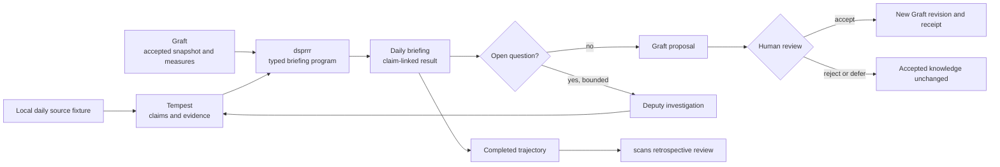

# Commons ecosystem alignment

Date: 2026-08-27
Status: Implemented and validated in isolated worktrees
Decision owner: ai4r package maintainers

## Decision

Adopt three ideas from the current `posit-dev/commons` work, but do not copy
its product API or add Commons as a runtime dependency:

1. Make trust a property of the path that produced each result, with direct
   evidence or calculation identity attached to every claim.
2. Review complete, reconstructable trajectories and promote only recurring,
   human-confirmed findings into trusted knowledge.
3. Test the few cross-package records that are expensive to let drift with
   executable producer-consumer fixtures.

Most of the ecosystem already has the right owners for these ideas. The
high-leverage package work is therefore small:

- **Deputy:** correct `run_r_code()` documentation and tool wording: it runs R
  in a separate process, but is not an operating-system security sandbox.
- **scans:** retain its current source-neutral Commons adapter and its existing
  producer-conformance test against a real `commons::trajectory_read()` result.
- **Tempest:** restore the narrow read-only trajectory-review accessor that
  scans already consumes, and let `tempest_knowledge()` rehydrate complete
  canonical Graft records rather than rejecting relation values produced by
  Tempest's own promotion path.
- **Graft and dsprrr:** make no new public API. Exercise their current contracts
  together in an offline daily-briefing example before considering additions.

The demonstration should be host-owned rather than a new generic framework. It
should use Graft for pinned accepted knowledge, dsprrr for fixed typed stages,
Deputy only for bounded open-ended investigation, Tempest for claim-centered
evidence and promotion proposals, and scans for retrospective trajectory
review.

## Audit basis

This review uses the Commons `main` branch at commit
[`44969e3`](https://github.com/posit-dev/commons/commit/44969e375350966d7c622da85a3d833482212a7f)
(`document private agent tools (#187)`, 2026-08-27 UTC). The source snapshot,
package documentation, tests, merged pull requests, open pull requests, and
open issues were inspected directly. No secondary descriptions were used.

The snapshot is current, but it is not a stable contract. The repository calls
Commons "highly experimental," and the
[R package is version `0.0.0.9003`](https://github.com/posit-dev/commons/blob/44969e375350966d7c622da85a3d833482212a7f/pkg-r/DESCRIPTION#L1-L4).
[The README's lifecycle notice](https://github.com/posit-dev/commons/blob/44969e375350966d7c622da85a3d833482212a7f/README.md#L5-L20)
is the controlling interpretation of every interface discussed below.

## What Commons is currently proving

### Trust follows execution

Commons distinguishes a trusted calculation, a cited answer, and an untrusted
answer according to the work that actually produced the answer. Its marker is
derived deterministically from successful tool calls; it is not assigned by
the model.

- The package-level model and its three result classes are documented in
  [`R/commons.R`](https://github.com/posit-dev/commons/blob/44969e375350966d7c622da85a3d833482212a7f/pkg-r/R/commons.R#L1-L12).
- The decision logic is explicit in
  [`R/provenance.R`](https://github.com/posit-dev/commons/blob/44969e375350966d7c622da85a3d833482212a7f/pkg-r/R/provenance.R#L1-L38):
  a fallback calculation does not become trusted, and a cited answer requires
  a verified quote.
- The truth table is an executable cross-language fixture in
  [`tests/shared/provenance.json`](https://github.com/posit-dev/commons/blob/44969e375350966d7c622da85a3d833482212a7f/tests/shared/provenance.json#L1-L74).
- Citation verification matches a normalized exact substring against the
  returned corpus and verifies the quote, not the surrounding explanation;
  see
  [`R/citations.R`](https://github.com/posit-dev/commons/blob/44969e375350966d7c622da85a3d833482212a7f/pkg-r/R/citations.R#L1-L67)
  and its
  [shared fixtures](https://github.com/posit-dev/commons/blob/44969e375350966d7c622da85a3d833482212a7f/tests/shared/citations.json#L1-L71).

This principle transfers directly to ai4r, but the A/B/C labels do not. Tempest
already represents two independent questions: how a result was executed and
how strongly its claim is supported. Collapsing those dimensions into a
single Commons label would discard useful scientific information.

There is also active evidence that the presentation vocabulary is not settled.
[PR #190](https://github.com/posit-dev/commons/pull/190) changed the R-facing
wording from "governed" to "trusted," while
[`test-provenance.R`](https://github.com/posit-dev/commons/blob/44969e375350966d7c622da85a3d833482212a7f/pkg-r/tests/testthat/test-provenance.R#L17-L36)
still adapts the shared fixture's wording for R. Open
[issue #195](https://github.com/posit-dev/commons/issues/195) questions the
related phrase "defined by your data team." The ecosystem should share the
semantic rule, not these user-interface strings.

Open [issue #189](https://github.com/posit-dev/commons/issues/189) exposes a
more important edge: a follow-up response that merely refers to a previously
trusted answer has no current provenance marker. The issue explicitly avoids
granting the follow-up a trusted marker. A daily briefing should avoid this
ambiguity by putting evidence and calculation identifiers directly on each
material claim rather than inheriting trust through conversation history.

### Trusted calculations are a narrow tool path

Commons does not make arbitrary generated code trusted. It promotes a named,
reviewed calculation and keeps custom SQL/R on a lower-trust path.

- The
  [main vignette](https://github.com/posit-dev/commons/blob/44969e375350966d7c622da85a3d833482212a7f/pkg-r/vignettes/commons.Rmd#L49-L93)
  explains trusted calculations versus custom code and path-derived
  provenance.
- A measure may hide arguments that the runtime injects, including its
  connection, so the model sees only the intended analytical inputs; see
  [`R/measures.R`](https://github.com/posit-dev/commons/blob/44969e375350966d7c622da85a3d833482212a7f/pkg-r/R/measures.R#L126-L201)
  and
  [connection injection](https://github.com/posit-dev/commons/blob/44969e375350966d7c622da85a3d833482212a7f/pkg-r/R/measures.R#L191-L239).
- Commons registers tools earned by composition. Without measures there is no
  measure search/call path; adding measures adds those tools. This is asserted
  in
  [`test-commons.R`](https://github.com/posit-dev/commons/blob/44969e375350966d7c622da85a3d833482212a7f/pkg-r/tests/testthat/test-commons.R#L1-L26).
  Measures are also deliberately absent from the provider-visible tool list,
  leaving the meta-tool to control their use
  ([test](https://github.com/posit-dev/commons/blob/44969e375350966d7c622da85a3d833482212a7f/pkg-r/tests/testthat/test-commons.R#L154-L168)).

Graft already owns the corresponding ai4r boundary: accepted measure identity,
revision history, and pinned snapshots. Dsprrr already owns deterministic
program identity. Recreating `measure()`, a semantic layer, or another tool
registry in Tempest or Deputy would introduce competing authorities.

### Context is curated and progressively disclosed

Commons separates facts that must always be present from reference material
that can be retrieved only when relevant.

- [`R/context-layer.R`](https://github.com/posit-dev/commons/blob/44969e375350966d7c622da85a3d833482212a7f/pkg-r/R/context-layer.R#L1-L8)
  states the distinction between instructions and retrieved context.
- Data-dictionary prose is reused at its natural table/column boundaries
  instead of indexing duplicate fragments
  ([implementation](https://github.com/posit-dev/commons/blob/44969e375350966d7c622da85a3d833482212a7f/pkg-r/R/context-layer.R#L37-L58)).
- Source frontmatter is removed before model-facing indexing, preserving
  provenance outside the content given to the model
  ([implementation](https://github.com/posit-dev/commons/blob/44969e375350966d7c622da85a3d833482212a7f/pkg-r/R/context-layer.R#L100-L124)).
- The package's authoring guidance explicitly favors a single curated source,
  reuse, and progressive disclosure
  ([data-dictionary guidance](https://github.com/posit-dev/commons/blob/44969e375350966d7c622da85a3d833482212a7f/pkg-r/inst/skills/commons/references/data-dictionaries.md#L29-L50)).

This is a good authoring discipline for a daily briefing, not a reason to add
generic `semantic_layer()` or `context_layer()` abstractions. Briefing context
should be projected from Graft's exact accepted snapshot and Tempest's exact
run workspace. The durable provenance remains outside the prompt text.

### Trajectories are evidence for product improvement

Commons reconstructs conversations for review and uses review findings to
improve trusted calculations and context.

- The public
  [`trajectory_read()`](https://github.com/posit-dev/commons/blob/44969e375350966d7c622da85a3d833482212a7f/pkg-r/R/trajectory-read.R#L1-L84)
  reads local or Posit Connect OTLP data and returns named lists of ellmer
  `Turn` objects, ordered oldest-first, with `last_active` and source metadata.
- The reader reconstructs the latest complete conversation rather than a
  partial span sequence
  ([implementation](https://github.com/posit-dev/commons/blob/44969e375350966d7c622da85a3d833482212a7f/pkg-r/R/trajectory-read.R#L650-L684)).
- Provenance is associated with the correct exchange and conflicts fail closed
  rather than being guessed
  ([association logic](https://github.com/posit-dev/commons/blob/44969e375350966d7c622da85a3d833482212a7f/pkg-r/R/trajectory-read.R#L710-L824)).
  Each reconstructed record has only the provenance tag and citation decisions
  ([record boundary](https://github.com/posit-dev/commons/blob/44969e375350966d7c622da85a3d833482212a7f/pkg-r/R/trajectory-read.R#L846-L860)).
- The review app filters, flags, annotates, and exports reviewed conversations
  as Markdown. It preserves the visible transcript and tool activity while
  listing citations separately and omitting provenance that cannot be
  reconstructed safely
  ([`R/trajectory-review.R`](https://github.com/posit-dev/commons/blob/44969e375350966d7c622da85a3d833482212a7f/pkg-r/R/trajectory-review.R#L1-L46)).
- Review-log tests preserve content order, omit low-value measure-discovery
  payloads, cap tool results, and expose unexpected provenance values rather
  than silently normalizing them
  ([tests](https://github.com/posit-dev/commons/blob/44969e375350966d7c622da85a3d833482212a7f/pkg-r/tests/testthat/test-trajectory-review-log.R)).

The improvement guide treats reviewed trajectories as primary evidence, raw
traces as a fallback, recurring user questions as concepts to group, and
human confirmation as a prerequisite for edits. It distinguishes new,
duplicate, extending, and conflicting knowledge rather than appending every
observation
([guidance](https://github.com/posit-dev/commons/blob/44969e375350966d7c622da85a3d833482212a7f/pkg-r/inst/skills/commons/references/iterating-from-trajectories.md)).

This is a strong match for scans and Graft. Scans should diagnose trajectories;
Graft should own the reviewed write. Neither a scan flag nor a Tempest proposal
should silently become accepted knowledge.

### Evaluation follows real questions and full traces

Commons' evaluation guidance begins with the questions users intend to ask,
whether they take the intended trust path, and whether unanswerable questions
are handled honestly. It recommends inspecting complete trajectories rather
than aggregate scores alone
([guidance](https://github.com/posit-dev/commons/blob/44969e375350966d7c622da85a3d833482212a7f/pkg-r/inst/skills/commons/references/evaluation.md#L13-L19)).
Representative questions should expand iteratively and retain held-out cases
([guidance](https://github.com/posit-dev/commons/blob/44969e375350966d7c622da85a3d833482212a7f/pkg-r/inst/skills/commons/references/evaluation.md#L43-L58)).
Expected values should be generated independently, arithmetic should be checked
deterministically, and a trajectory scorer should be used when the path matters
([guidance](https://github.com/posit-dev/commons/blob/44969e375350966d7c622da85a3d833482212a7f/pkg-r/inst/skills/commons/references/evaluation.md#L59-L90)).

This is process guidance that fits Tempest's existing vitals boundary. It does
not justify another evaluation API.

### Arbitrary R requires an actual security boundary

The most substantial recent Commons implementation work is its private R tool.
It uses a persistent `callr` worker but does not describe process separation
alone as a sandbox.

- The governance vignette says SQL parsing is a safeguard rather than a
  sandbox; read-only database permissions and viewer identity are the real
  authority boundary
  ([vignette](https://github.com/posit-dev/commons/blob/44969e375350966d7c622da85a3d833482212a7f/pkg-r/vignettes/governance.Rmd#L31-L45)).
- Generated R runs with operating-system isolation on supported platforms,
  network and filesystem restrictions, an 8 GiB memory cap, a scrubbed
  environment, and fail-closed behavior when required isolation is unavailable
  ([vignette](https://github.com/posit-dev/commons/blob/44969e375350966d7c622da85a3d833482212a7f/pkg-r/vignettes/governance.Rmd#L51-L79)).
- The implementation gives every Commons agent a private persistent R session
  and queues calls without blocking the Shiny session
  ([tool contract](https://github.com/posit-dev/commons/blob/44969e375350966d7c622da85a3d833482212a7f/pkg-r/R/run-r.R#L1-L130)).
  It scrubs the worker environment
  ([implementation](https://github.com/posit-dev/commons/blob/44969e375350966d7c622da85a3d833482212a7f/pkg-r/R/run-r.R#L265-L389)),
  polls asynchronously and restarts after a timeout
  ([implementation](https://github.com/posit-dev/commons/blob/44969e375350966d7c622da85a3d833482212a7f/pkg-r/R/run-r.R#L779-L862)),
  and creates a worker-only library plus native sandbox and memory limit
  ([implementation](https://github.com/posit-dev/commons/blob/44969e375350966d7c622da85a3d833482212a7f/pkg-r/R/run-r.R#L869-L958)).
- Tests verify persistent state, a worker-local library, secret removal,
  timeout recovery, crash recovery, and sequential execution
  ([worker tests](https://github.com/posit-dev/commons/blob/44969e375350966d7c622da85a3d833482212a7f/pkg-r/tests/testthat/test-run-r.R#L55-L77),
  [failure tests](https://github.com/posit-dev/commons/blob/44969e375350966d7c622da85a3d833482212a7f/pkg-r/tests/testthat/test-run-r.R#L230-L280)).
  Platform tests assert fail-closed and actual filesystem/network denial
  ([sandbox tests](https://github.com/posit-dev/commons/blob/44969e375350966d7c622da85a3d833482212a7f/pkg-r/tests/testthat/test-sandbox.R#L10-L65),
  [denial tests](https://github.com/posit-dev/commons/blob/44969e375350966d7c622da85a3d833482212a7f/pkg-r/tests/testthat/test-sandbox.R#L225-L277)).

Recent merged changes include an
[8 GiB memory cap in PR #170](https://github.com/posit-dev/commons/pull/170),
[worker-library installs in PR #183](https://github.com/posit-dev/commons/pull/183),
and clearer
[private-session documentation in PR #184](https://github.com/posit-dev/commons/pull/184).

Deputy's current `run_r_code()` uses `callr::r()` with a timeout. That is useful
process isolation, but it lacks the native restrictions, fail-closed policy,
environment scrubbing, and lifecycle tests that support Commons' sandbox
claim. Deputy's README already acknowledges this distinction; its function and
tool descriptions should do the same. Porting Commons' implementation is not a
small correction and should not be bundled into the briefing demonstration.
The demonstration should use reviewed Graft calculations and fixed dsprrr
programs instead of arbitrary model-generated R.

## Current versus experimental surfaces

Everything in Commons remains experimental at the package level. Within that
constraint, "current" below means merged and exercised on the audited `main`
snapshot; it does not mean a promised stable API.

| Area | Current on audited `main` | Still in motion | ai4r response |
|---|---|---|---|
| Path-derived trust | Deterministic classification and shared truth-table tests | Follow-up attribution in [#189](https://github.com/posit-dev/commons/issues/189); wording in [#195](https://github.com/posit-dev/commons/issues/195) | Reuse the semantic rule; retain Tempest's richer two dimensions and package vocabulary |
| Measures | Narrow trusted-calculation path; injected hidden arguments; meta-tool discovery | Public constructor vocabulary remains experimental | Keep Graft as authority and dsprrr as program owner; add no Commons layer |
| Context | Curated retrieval and data dictionaries | Search/index choices are Commons internals | Apply progressive-disclosure discipline in the host example only |
| Trajectory ingestion | Public `trajectory_read()` record shape and fail-closed association | Marker replay refinements in open [PR #197](https://github.com/posit-dev/commons/pull/197) | Keep scans adapter narrow; test one real producer output |
| Trajectory review | Full transcript/tool review and Markdown export | Review presentation is still changing | Borrow review discipline, not UI or Markdown schema |
| R execution | Persistent, asynchronous worker plus native sandbox restrictions | Young, platform-sensitive implementation | Fix Deputy wording now; defer any real sandbox to a separate security design |
| Shiny | `commons_app()`, theme, and one agent per session after [PR #169](https://github.com/posit-dev/commons/pull/169) | [Issue #171](https://github.com/posit-dev/commons/issues/171) proposes removing `commons_server()`; open [PR #199](https://github.com/posit-dev/commons/pull/199) changes working-state UI | Keep Tempest's single `tempest_app()` boundary; copy no Commons server/theme API |
| Database tools | Read-only connection is the authority boundary | Synchronous DBI can block all Shiny users in open [#29](https://github.com/posit-dev/commons/issues/29) | Do not generalize the unfinished concurrency model |
| Reproducible conversations | Exact tool results and provenance can be reconstructed | Reproducible generated calculations remain open in [#91](https://github.com/posit-dev/commons/issues/91) | Pin Graft revisions and dsprrr artifacts in the briefing |
| External agents | Commons configures its own ellmer agent | MCP/headless/external-agent sharing is unresolved in [#135](https://github.com/posit-dev/commons/issues/135) | Do not add a Commons-to-Deputy bridge |

The shared-fixture strategy is deliberately narrow. Commons says these fixtures
are for a behavior implemented in more than one language whose drift would be
expensive; they are not a second specification or a place for every test
([fixture contract](https://github.com/posit-dev/commons/blob/44969e375350966d7c622da85a3d833482212a7f/tests/shared/README.md#L1-L29)).
That same restraint should govern ai4r producer-consumer tests.

## Package-by-package recommendations

| Package | Recommendation | Why now | Public API impact |
|---|---|---|---|
| Graft | No new feature. Use an exact accepted snapshot and accepted measure revision as the daily briefing's knowledge/calculation basis. Preserve proposal-review-commit as the only acceptance path. | It already owns the high-value Commons ideas: reviewed measures, provenance, revisions, receipts, and historical reads. | None |
| dsprrr | No new feature. Define the briefing's fixed stages as a typed program artifact and record that exact artifact identity. | This gives deterministic procedure identity without another workflow or measure abstraction. | None |
| Deputy | Correct the `run_r_code()` roxygen and model-facing description to say "separate subprocess, not a security sandbox." Keep arbitrary R out of the briefing. | Commons' tests show what a defensible sandbox claim requires; Deputy's current implementation does not meet that bar. | Documentation/description correction only |
| Tempest | Restore `tempest_trajectory_review_data()`, the closed read-only accessor required by the current scans adapter. Make `tempest_knowledge()` accept the complete canonical values emitted by the existing Tempest-to-Graft promotion path. Build the demonstration from the existing product entry points and explicit Graft promotion chain. | The vertical slice exposed two regressions in existing composition boundaries; neither requires a new owner or abstraction. | One previously public accessor restored; no new concept |
| scans | Keep the existing adapter over the class-light output of `commons::trajectory_read()` and its existing real-producer fixture test. | The current consumer contract matches the audited producer and already has the right conformance guard. | None |

### Exact small changes worth making

#### Deputy wording

Change both the exported documentation and the text shown to the model. The
accurate promise is:

> Runs R code in a separate R subprocess with a timeout. This isolates the
> agent session from crashes and lingering state; it is not an operating-system
> security sandbox.

The change should not add configuration, platform detection, or a compatibility
branch. If ai4r later needs untrusted-code execution, design that boundary
separately with native restrictions, a fail-closed default, secret scrubbing,
resource limits, and adversarial platform tests.

#### scans conformance test

The current scans suite already has the intended integration smoke. It:

1. creates or reads a small local OTLP fixture through the public
   `commons::trajectory_read()`;
2. passes that object, unmodified, to scans' public adapter;
3. verifies conversation order, `last_active`, source identity, provenance tag,
   citation decisions, and explicit loss reporting;
4. fails when a conflicting or malformed producer record would otherwise be
   guessed;
5. skips when the compatible optional Commons package is not installed.

The test passed against the audited Commons snapshot. No scans change is
needed. Do not copy Commons' private span schema, review Markdown, UI, or
internal provenance fixture into scans. The valuable contract is the public
producer object.

#### Tempest composition repairs

Restore `tempest_trajectory_review_data()` as a strict, read-only projection of
an already-closed `TempestTrajectoryReview`. This is the public seam used by
scans; it must not expose mutable product state.

Use Tempest's existing canonical Graft-value normalization when
`tempest_knowledge()` rehydrates accepted records. Scalar values remain plain
prompt text; relation values use deterministic canonical JSON, and unsupported
live objects still fail closed. This makes the accepted output of
`tempest_graft_plan()` valid input to the next briefing without inventing a
second knowledge representation.

## Daily briefing vertical slice

The demonstration is valuable only if it proves the packages cooperate without
creating a sixth owner. Keep it as a Tempest ecosystem vignette backed by an
offline deterministic integration test.

### User experience

Every briefing should answer six questions in this order:

1. **What changed?** A bounded comparison against the prior accepted snapshot.
2. **Why does it matter?** Claim-centered interpretation, including uncertainty
   and contradiction.
3. **What is the basis?** Evidence-span identifiers, accepted measure and
   revision identifiers, and explicit limitations attached to the claim.
4. **What should I do?** A recommendation labeled as recommendation, not fact.
5. **What should we remember?** A proposed Graft change with new, duplicate,
   extension, or conflict disposition.
6. **What did the reviewer decide?** Accept, reject, or defer; only acceptance
   creates a new Graft revision and receipt.

A day with no material change is a first-class successful result. It should
produce a concise no-change briefing with the exact data/knowledge/program
identities used, not prompt the agent to invent novelty.

### Ownership and flow

- **Graft** supplies an immutable accepted snapshot plus the exact accepted
  measure/revision used. It accepts only an explicit reviewed plan.
- **dsprrr** owns a small typed program for fixed collection, comparison, and
  synthesis stages. Its artifact identifier records the procedure that ran.
- **Tempest** owns sources, evidence spans, claims, disputes, uncertainty,
  report material, and the promotion proposal.
- **Deputy** is invoked only when the fixed program finds a genuine open-ended
  question. It receives explicit tools, permissions, and budget. The vertical
  slice does not grant it arbitrary R.
- **scans** reviews the completed producer trajectories after the fact; it does
  not govern the briefing or write accepted knowledge.
- **The host** schedules and renders the briefing. Scheduling, notification,
  and personal preference are not new package concepts.

Operational state and accepted knowledge must remain separate. "The briefing
ran," "the user saw it," and "the user reviewed it" are useful events, but none
means a proposed fact was accepted. This separation also makes replay honest:
the same source fixture, Graft snapshot, and dsprrr artifact should yield the
same deterministic core even if display or review state changes.

### Minimal demonstration scenarios

Use a tiny fictional research topic and local fixtures, with no API keys or
network calls:

1. **Material change:** a new source supports one claim, contradicts another,
   and produces a Graft extension proposal.
2. **No change:** the new day's source adds no material information, so no
   promotion proposal is fabricated.
3. **Conflict:** new evidence conflicts with accepted knowledge; the briefing
   surfaces the dispute and the human defers acceptance.
4. **Open question:** a missing explanation triggers one fake, budgeted Deputy
   investigation whose output remains provisional until supported by Tempest
   evidence.
5. **Trajectory review:** scans consumes the completed result and identifies
   the claim/tool path without acquiring promotion authority.

The example should produce a human-readable Markdown briefing plus a compact
machine-readable manifest containing source digests, Graft snapshot/revision,
dsprrr program artifact, Tempest product identity, optional Deputy run identity,
claim-to-evidence links, recommendation status, proposal identity, and human
decision. The manifest is an example contract, not a new universal artifact
type.

## Validation gates

Validate the vertical slice from both package and ecosystem perspectives:

### Contract assertions

- Every material factual claim has at least one direct evidence-span or
  accepted-calculation reference.
- A recommendation cannot be rendered as accepted knowledge.
- No follow-up text inherits trust from an earlier answer without its own
  identity references.
- Rejected, deferred, conflicted, and unsupported claims never create a Graft
  revision.
- The accepted revision and measure identifiers exist in the exact pinned
  Graft snapshot.
- The recorded dsprrr program artifact is the one executed.
- A no-change day succeeds without creating a proposal or synthetic novelty.
- Replaying the same deterministic inputs preserves the briefing's core digest
  and does not duplicate a proposal.
- scans can convert the completed producer trajectory and reports its losses
  explicitly.
- Trajectories and rendered output contain no credentials, raw environment,
  private filesystem paths, or live package objects.

### Test sequence

1. Run focused tests in each changed package.
2. Run each changed package's full offline suite.
3. Run the complete daily-briefing fixture against the local package checkouts
   using fake chats and local stores.
4. Run the optional scans/Commons producer-conformance smoke against the pinned
   Commons snapshot.
5. Run formatting, documentation, pkgdown, and R CMD check gates only in
   packages actually changed.
6. Inspect the rendered briefing and full trajectory, not only snapshots or an
   aggregate evaluation score.

Add a small held-out set only after the vertical slice is coherent: one
unanswerable question, one misleading but lexically similar citation, one
duplicate knowledge proposal, and one changed program artifact. This targets
the failure modes Commons' provenance and evaluation tests make visible without
creating a broad benchmark prematurely.

## Adaptations to reject

- Do not import Commons merely to reuse product vocabulary or UI.
- Do not add `semantic_layer()`, `context_layer()`, or `measure()` peers to
  Tempest, Deputy, or dsprrr.
- Do not replace Tempest's independent execution-path and support-status fields
  with one A/B/C label.
- Do not infer provenance from prose, conversation position, correlation IDs,
  or review flags.
- Do not make a Tempest proposal or scans finding self-accepting.
- Do not expose another generic workflow, runtime, artifact, capability,
  connection, or agent-session layer.
- Do not copy `commons_server()` or working-state UI while those boundaries are
  actively changing.
- Do not call process separation a security sandbox.
- Do not port Commons' private sandbox as incidental briefing work.
- Do not make the demonstration depend on live providers, Connect, network
  access, personal data, or a scheduler.
- Do not add package APIs until the offline vertical slice identifies a real
  ownership gap that cannot be expressed by the existing contracts.

## Completed validation

- Refreshed Commons `main` after implementation; it remained at
  `44969e375350966d7c622da85a3d833482212a7f`.
- Installed Commons 0.0.0.9003 and scans `f44bbe4` in an isolated library.
- Passed scans' real Commons producer/consumer adapter tests: 58 assertions.
- Passed the focused Tempest knowledge and briefing tests: 40 assertions.
- Passed the complete Tempest suite: 5,508 assertions, no failures, warnings,
  or skips.
- Passed Tempest pkgdown validation and `R CMD check`: 0 errors, 0 warnings,
  and 0 notes.
- Passed Deputy's focused tool tests: 113 assertions; its two expected
  filesystem warnings and one optional-backend skip are pre-existing.
- Passed the complete Deputy suite: 2,079 assertions, with the same two
  pre-existing filesystem warnings and six optional-integration skips.
- Passed Deputy pkgdown validation and `R CMD check`: 0 errors, 0 warnings,
  and 0 notes.
- Passed `air format . --check` and `git diff --check` in both changed
  worktrees.

## Follow-up order

1. Correct Deputy's sandbox wording and test the model-facing description.
2. Verify scans' existing real-producer conformance test against current
   Commons.
3. Build the host-owned offline daily-briefing vertical slice.
4. Repair only the existing composition contracts the slice proves broken.
5. Run focused and full package validation, then review the complete briefing
   and trajectory.

This order extracts the strongest lessons from Commons immediately while
keeping the ai4r packages small, composable, and honest about their authority.
